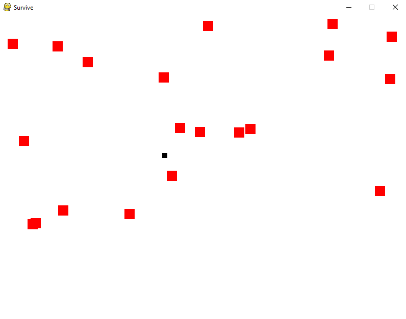

# python games

A few games

#### flappybird.py

* Use the "SPACE" key to jump and to avoid the red boxes
* TODO
  * add a moving background and images
  * change time counter to count for survived blocks
  
#### survive.py

* Use the "WASD" keys to avoid the red boxes
* TODO
  * add some "coins" that need to be collected to incentivize the player to move
