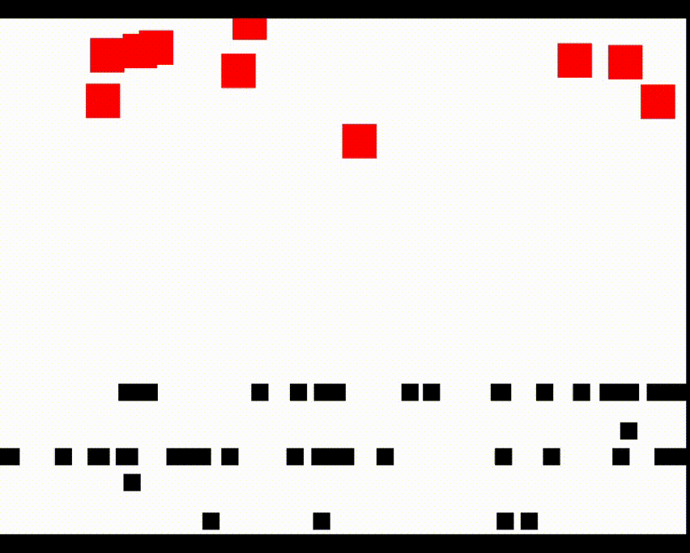
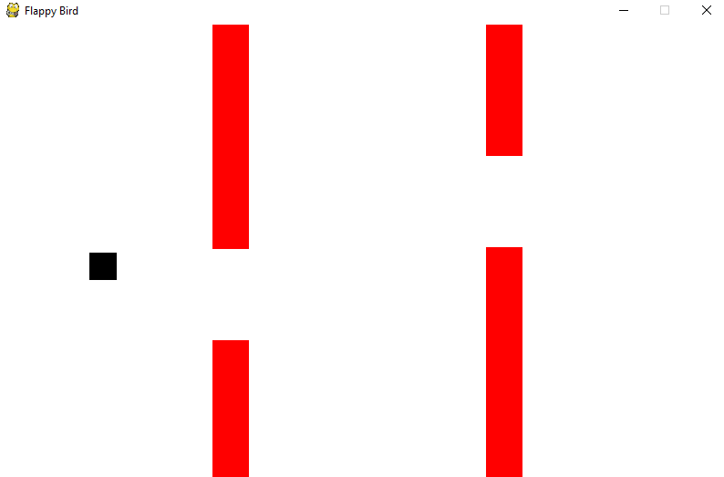

# python games and AI

A few games and some AI implementation

#### survive.py and survive_with_NEAT.py

* Use the "WASD" keys to avoid the red boxes
* The survive_with_NEAT.py contains an implementation of NEAT (NeuroEvolution of Augmenting Topologies)
* TODO
  * add some "coins" that need to be collected to incentivize the player to move

#### flappybird.py

* Use the "SPACE" key to jump and to avoid the red boxes
* TODO
  * add a moving background and images
  * change time counter to count for survived blocks
  * add NEAT